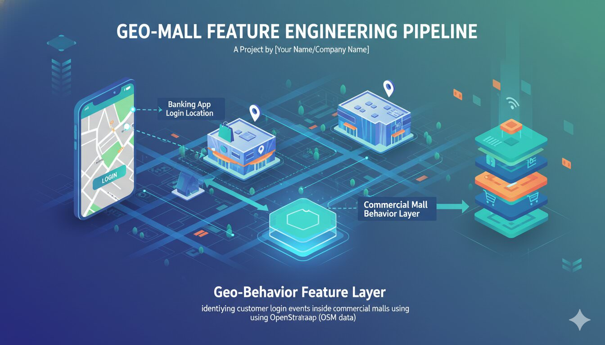

# Geo-Mall Feature Engineering Pipeline



Identify whether customer login coordinates are inside mall polygons in Hanoi (OpenStreetMap + Overpass), then build map-ready and ML-ready behavioral features.

## Highlights
- Mall polygon fetch with local cache support
- Point-in-polygon labeling with GPS buffer
- Time-bin enrichment: `morning`, `noon`, `afternoon`, `night`
- Interactive Folium map:
  - Mall polygon overlays
  - Layer filters by time bin
  - Mall search box

## Project Files
- Core code: `main_python.py`
- Full documentation: `documentation.md`
- Cover image: `assets/geomall-banner.jpg`
- Generated outputs:
  - `storage/overpass_hanoi_malls_cache.json`
  - `storage/hanoi_mall_logins_map.html`

## Quick Start
```bash
pip install -r requrirements.txt
python main_python.py
```

Then open:
- `storage/hanoi_mall_logins_map.html`

Jupyer Notebook Version (no difference than main file):
- `storage/hanoi_mall_logins_map.html`

## Runtime Config (in `main_python.py`)
```python
MAX_MALLS = 3
MALL_KEYWORDS = ("aeon", "vincom", "lotte")
USE_CACHE = True
FORCE_REFRESH_CACHE = False
CACHE_FILE = Path("storage/overpass_hanoi_malls_cache.json")
```
