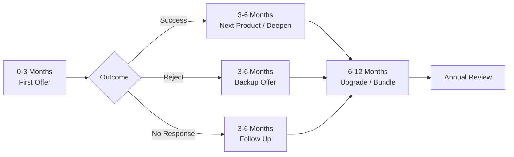
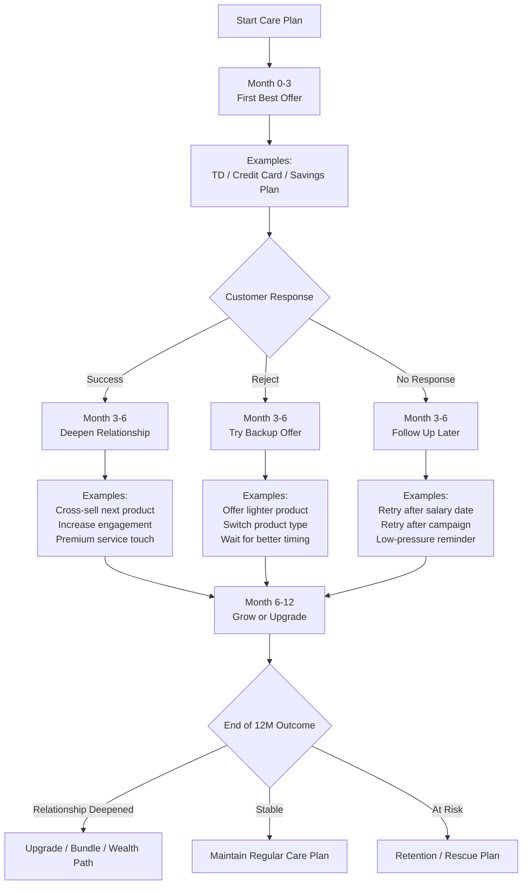

Here is the summary plan for this feature.

## Feature summary

This feature is a **CRM care-plan assistant for sales in banking**.

Its purpose is not to make sales read a complicated tree.
Its purpose is to help them answer:

* who should I contact now
* what should I offer
* why this offer
* what should I do if the customer rejects

So the system should generate a **simple care plan** for each customer across **3, 6, and 12 months**, with:

* one recommended action
* one backup action
* one follow-up date

---

## Main concept

The feature combines:

* **Customer 360 data**
* **business rules**
* **ML scoring**
* **simple outcome tracking**

to produce a **Next Best Action** and a **lightweight care plan**.

It should feel like a practical sales copilot, not a complex analytics tool.

---

## What the salesperson sees

On the CRM screen, the salesperson should see:

* customer summary
* current opportunity / objective
* recommended action
* why it is recommended
* backup action if rejected
* next review date
* outcome buttons:

  * Success
  * Reject
  * No Response

That is enough for the first version.

---

## Simple care-plan logic

### 0–3 months

Focus on the **first best offer**.

Examples:

* Term deposit
* Credit card
* Savings / liquidity product

### 3–6 months

Based on result:

* if success → deepen relationship
* if reject → try backup offer
* if no response → follow up later

### 6–12 months

Move to:

* upgrade
* bundle
* retention
* annual review

So the plan stays simple:
**first offer → outcome → next action → annual direction**

---

## Core system flow

### Inputs

Use:

* demographics
* location
* behavior
* spending
* lifestyle
* AUM movement
* engagement / care score
* current product holdings
* recent contact / service history

### Decision layer

The engine should combine:

* **Rule engine**

  * eligibility
  * product policy
  * suppression / cooldown
  * service issue blocking
* **ML scoring**

  * product propensity
  * response likelihood
  * timing
  * contact fatigue risk

### Output

The engine produces:

* recommended action
* backup action
* follow-up timing
* simple care plan status

---

## How rejection should work

If customer rejects, the system should not stop at “rejected”.

It should capture:

* offered product
* rejection reason
* optional note
* channel
* date
* salesperson

Then map that into a simple next step.

Examples:

* needs liquidity → offer shorter tenor / partial placement later
* timing not right → set follow-up date
* rate unattractive → wait for campaign
* no interest → suppress and switch focus
* service issue → pause sales and recover service

So rejection becomes useful learning, not dead-end logging.

---

## Recommended rollout approach

### Phase 1 — MVP

Build:

* Customer 360 summary
* simple Next Best Action
* backup action
* care-plan timeline 3 / 6 / 12 months
* outcome capture
* rejection reason capture
* basic fallback rules

Start with **one use case only**, ideally:

* CASA to TD
  or
* credit card cross-sell

### Phase 2

Add:

* ML ranking
* better follow-up timing
* channel recommendation
* fatigue / over-contact control

### Phase 3

Add:

* LLM support for note summarization
* script suggestions
* natural-language explanation for sales

But LLM should be helper only, not decision maker.

---

## Design principle

This feature should feel:

* simple
* actionable
* explainable
* fast to use

Not:

* too many branches
* too many scores
* too much planning detail

The system should do the complexity in the backend, and show the salesperson only the next clear move.

---

## Final product statement

This feature is a **banking CRM care-plan engine** that helps sales manage each customer with a simple 3 / 6 / 12 month plan, recommends the next best action, handles rejection intelligently, and keeps updating the plan based on customer response.

A good final experience is:

* open customer
* see recommendation
* contact customer
* log outcome
* get next step automatically

That is the right level of usefulness.

If you want, I can turn this into a **one-page product spec** with sections like objective, users, scope, data, workflow, UI, and rollout.

CHART:
Very simple reading
First 3 months: try the best first offer
Next 3 months: depending on result, either deepen, switch, or follow up
Last 6 months: decide whether to grow, maintain, or retain

architecture chart

flowchart LR
    A[Customer Data] --> B[Customer 360 Profile]
    B --> C[Rule Engine]
    B --> D[ML Scoring]
    
    C --> E[Next Best Action Engine]
    D --> E
    
    E --> F[Simple Care Plan]
    
    F --> G[Recommended Action]
    F --> H[Backup Action]
    F --> I[Review Date]
    
    G --> J[CRM Screen for Sales]
    H --> J
    I --> J
    
    J --> K{Sales Outcome}
    
    K -->|Success| L[Move to Next Product / Next Stage]
    K -->|Reject| M[Capture Reason + Suggest Fallback]
    K -->|No Response| N[Set Follow-up Date]
    
    L --> O[Update Care Plan]
    M --> O
    N --> O

